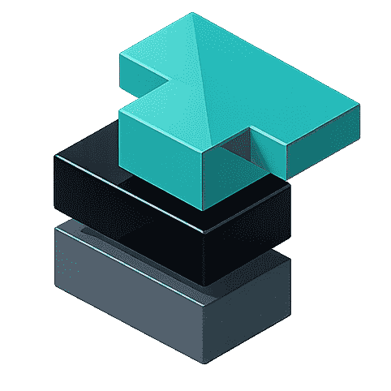

# Ternary Intelligence Stack (TIS)

[](#architecture)
[](https://crates.io/crates/ternlang-core)
[](LICENSE)
[](#architecture)
[](https://ternlang-api.fly.dev/health)
[](https://ternlang.com/compliance)
[](#sparse-ternary-inference)
[](#live-api)
[](https://smithery.ai/servers/rfi-irfos/ternlang)
[](#example-library)
[](ternlang-root/stdlib/PREMIUM.md)
[](https://doi.org/10.17605/OSF.IO/TZ7DC)

Ternlang is a systems programming language, compiler, and high-performance inference runtime built on balanced ternary logic. We provide a fundamental architectural shift for **Explainable AI (XAI)** and European technological sovereignty.

Built by [RFI-IRFOS](https://ternlang.com) · Graz, Austria · Whitepaper [https://osf.io/cyn28/files/8hzux]


---

## Technical Pillars

- **Deterministic Uncertainty**: Ternlang's `trit` (affirm/tend/reject) provides a first-class routing mechanism for **Uncertainty-Aware AI**, eliminating "hallucinated confidence."
- **Sparsity-Aware Inference Engine**: Native `@sparseskip` optimization achieves up to 122x throughput gains by bypassing zero-signal (`tend`) weights at the hardware primitive level.
- **Explainable AI (XAI) by Design**: Every decision is auditable and traceable, fulfilling **EU AI Act Articles 13, 14, and 15** mandates for algorithmic transparency and human oversight.
- **Post-Binary Systems Architecture**: A full-stack ecosystem including a custom **Instruction Set Architecture (ISA)**, triadic networking, and memory-efficient ternary encoding.

The core type is `trit`: three values — `−1` (reject), `0` (hold), `+1` (affirm).
The zero state is a first-class routing instruction: *"insufficient confidence — do not act yet."*

Ternlang provides a machine-readable path to human escalation instead of a forced binary guess. This is the foundation for **Post-Binary Intelligence**.

---
## Full Documentation
  
→ **[ternlang-root/README.md](ternlang-root/README.md)** (Full explanation, technical details, and compiler specs)


→ **[ROADMAP.md](ternlang-root/ROADMAP.md)** (Phases 1–18, session log, priority matrix)


→ **[Ternlang Studio Preview](https://ternlang-api.fly.dev/studio)** — Our work-in-progress SDK

---

## Team

The Ternary Intelligence Stack is built by a core team of three co-founders from **RFI-IRFOS**, Graz:

*   **Simeon Kepp**: Head of Research & Systems Architect.
*   **Nikoletta Csonka**: Head of Strategic Outreach & EU Relations.
*   **Zabih Karimi**: Principal Network & ML Engineer.

**[Read our BIO and Mission in LEADERSHIP.md](LEADERSHIP.md)**

---

## Performance Benchmarks

| Feature | Performance Gain | Industry Comparison |
|---------|------------------|---------------------|
| **Ternary Inference** | 2.3x (baseline) | Up to 122x at 99%+ Sparsity |
| **Data Density** | 1.25x improvement | 5-trit block packing (8-bit) |
| **Logic Consistency** | 100% Deterministic | Eliminates binary timeout/null-guessing |
| **Safety Latency** | < 1ms hard-veto | Axis-6 Veto Hard Gate |

---

## Quick start

```bash
cargo install ternlang-cli
```

That's it. The `ternlang` binary is now in your PATH:

```bash
ternlang                        # → interactive REPL, start typing trit expressions
ternlang my_program.tern        # → run a .tern file directly
ternlang run my_program.tern    # → same (explicit form)
ternlang build my_program.tern  # → compile to .bet bytecode
ternlang fmt my_program.tern    # → format source file
ternlang repl                   # → interactive REPL (explicit)
ternlang test                   # → run test suite
```

Or build from source:

```bash
git clone https://github.com/eriirfos-eng/ternary-intelligence-stack
cd ternary-intelligence-stack/ternlang-root
cargo build --release
./target/release/ternlang examples/03_rocket_launch.tern
```

---

## Repository layout

| Directory | Contents |
|-----------|----------|
| [`ternlang-root/`](https://github.com/eriirfos-eng/ternary-intelligence-stack/tree/main/ternlang-root) | All Rust crates — compiler, VM, API, MCP server, ML stack |
| [`ternlang-root/stdlib/`](https://github.com/eriirfos-eng/ternary-intelligence-stack/tree/main/ternlang-root/stdlib) | 293 open-core `.tern` modules (Tier 1 — free) |
| [`ternlang-root/examples/`](https://github.com/eriirfos-eng/ternary-intelligence-stack/tree/main/ternlang-root/examples) | Runnable `.tern` examples (medical, finance, aerospace, etc.) |
| [`ternlang-root/spec/`](https://github.com/eriirfos-eng/ternary-intelligence-stack/tree/main/ternlang-root/spec) | BET-ISA spec, language reference, grammar, protocol specs |
| [`ternlang-root/ternlang-web/`](https://github.com/eriirfos-eng/ternary-intelligence-stack/tree/main/ternlang-root/ternlang-web) | ternlang.com frontend (GitHub Pages) |
| `eriirfos-eng/ternlang-premium` *(private)* | 28,495+ proprietary `.tern` modules — Tier 2 / 3 / 4 |

---

## Live API

```bash
# Health check
curl https://ternlang.com/health

# MoE-13 ternary decision via MCP (no key required)
curl -X POST https://ternlang.com/mcp \
  -H "Content-Type: application/json" \
  -d '{"jsonrpc":"2.0","id":1,"method":"tools/call","params":{"name":"moe_orchestrate","arguments":{"query":"Should I proceed?"}}}'
```

---

## StdLib Access

The standard library is split across two repos to protect paid-tier IP:

- **Tier 1 (free):** 293 open-core modules in [`ternlang-root/stdlib/`](ternlang-root/stdlib/) — clone this repo and use immediately
- **Tier 2/3/4 (paid):** 28,495+ proprietary modules in the private `eriirfos-eng/ternlang-premium` repo

After purchasing: visit **[ternlang.com/activate](https://ternlang.com/activate)** — enter your API key + GitHub username and you'll receive a collaborator invite to the private repo automatically.

→ [Full tier breakdown](ternlang-root/stdlib/PREMIUM.md)

---

## Licensing

| Tier | Price | Details |
|------|-------|---------|
| Community (LGPL-3.0) | Free | Compiler, VM, CLI, LSP, 293 stdlib modules + **30 MCP tools (all free)** |
| Pro Standard (BSL-1.1) | €99/month | REST API (10,000 calls/month), server-side 3-layer memory, SSE streaming + Tier 2 stdlib |
| Industrial (BSL-1.1) | €349/month | 50,000 API calls, QNN, SEC, T-HAL, TernAudit + Tier 3 stdlib |
| Enterprise (Proprietary) | From €2,500/month | unlimited API calls | On-premise, FPGA, custom SLA + full Tier 4 stdlib | lifetime support|

Commercial licensing: [licensing@ternlang.com](mailto:licensing@ternlang.com)

---

<div align="center">
  
</div>
