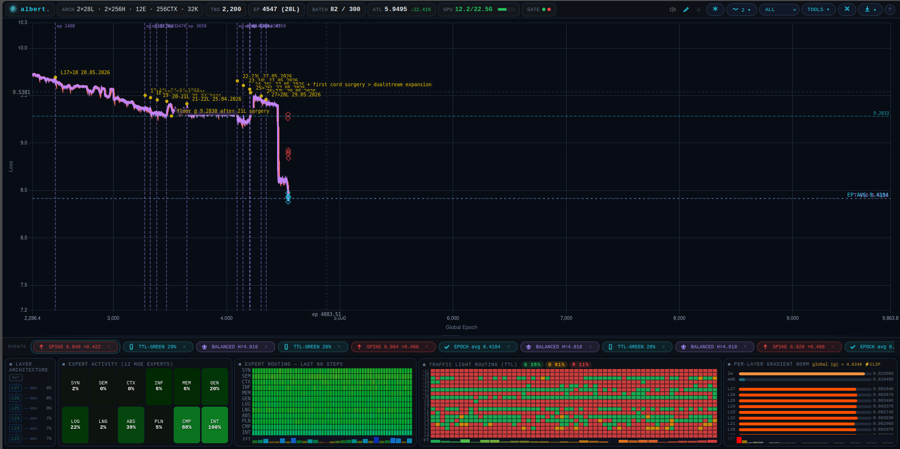

# Albert MoE-13

**Ternary-native dual-stream Mixture-of-Experts language model** — weights constrained to {-1, 0, +1}, trained from scratch with real-time dashboard telemetry. GPU training via Modal (T4).

**Architecture milestone (2026-05-27):** Single-stream architecture autonomously bifurcated into dual-stream 2×256H via cord surgery — the first documented instance of a live ternary MoE growing from one stream to two mid-training. No prior art.

Part of the [Ternary Intelligence Stack](https://github.com/eriirfos-eng/ternary-intelligence-stack) | RFI-IRFOS, Graz · Patent Pending A50296/2026

---



---

## Run the Benchmark (one line)

```bash
curl -fsSL https://raw.githubusercontent.com/eriirfos-eng/ternary-intelligence-stack/main/albert-moe-13/bench/install.sh | sh
```

Downloads the model, runs three suites (inference speed · @sparseskip analysis · perplexity), exports `albert_bench_results.csv`. Linux and macOS. No GPU required.

**First published result — HP ZBook 15 (i7-4800MQ, 2013, CPU only):** `84.4 tok/s · 11.8 ms/tok · 75% expert skip rate`

---

## What it is

Albert MoE-13 is a research organism — a working instance of a philosophy of computing that, until now, only existed as scattered intuitions across sixty years of papers nobody connected. You do not engineer it. You cultivate it: set the substrate, the growth rules, the curriculum ladder, the plateau gates — and observe what develops within those conditions rather than dictating it. The expert specializations, the hot-layer hierarchy, the decision not to grow when growth would interrupt productive learning — these emerge from the system, not from the operator.

The technical substrate: ternary weights `{-γ, 0, +γ}` throughout training reduce matmuls to integer additions — no multiplies — making inference 2–5× cheaper per parameter on standard hardware and far cheaper on future ternary silicon.

---

### Observed: Cross-Lingual Semantic Broadcasting

A phenomenon documented during training and confirmed across 28 benchmark runs (ep0 → ep1573):

Albert's multilingual corpus (~446 MB, 8 languages) encodes domain knowledge in parallel across languages. During the pre-fluency training phase, the model demonstrates **correct domain clustering** — it pulls tokens from the semantically appropriate neighborhood for each prompt — but activates all eight languages simultaneously rather than committing to one.

Evidence from ep1549 benchmark outputs:

| Prompt domain | Tokens produced | Translation / significance |
|--------------|-----------------|---------------------------|
| "the meaning of life" | `res`, `alors`, `chi`, `prof`, `diferentes` | Latin *res* (Descartes: res cogitans), French *alors* (therefore), Italian *chi* (who), Spanish *diferentes* (different) — philosophy register |
| "in the beginning god created the" | `word` | John 1:1 exact — theological precision on first token |
| "mixture of experts… routing" | `Regier`, `model`, `design` | German *regieren* = to govern/steer — semantic equivalent of "routing" |
| "Isaac Newton… gravitation" | `universel`, `light`, `ainsi` | French *universel* (universal), Newton's optics, French scientific connective |
| "Bibel… Buch Mose" | `Roman`, `Michael`, `Guerra` | Romans (book of Bible), archangel, Old Testament warfare |

**The model is not producing random multilingual noise.** It is broadcasting domain-correct tokens across all trained languages at once, because it has not yet learned to gate language selection. The semantic knowledge is present and domain-accurate; the representational capacity to *select one language* is what the ongoing 20L→21L expansion is expected to consolidate.

**Training phase arc** (observed across ep0–ep1573):

| Phase | Epoch range | Signature |
|-------|------------|-----------|
| 1 — Byte chaos | ep0 | Sub-token fragments, no recognizable words |
| 2 — Token formation | ep~111 | Single coherent words, no sequencing |
| 3 — Repetition collapse | ep~489–551 | STALL-VETO era, loops on common tokens |
| 4 — Function word emergence | ep~792 | English connectives appear (`following`, `National`, `approach`) |
| 5 — Cross-lingual semantic broadcasting | ep1352–1573 | Domain-correct tokens, all languages active simultaneously |
| 6 — Language consolidation + fluency | post-surgery (target) | One language selected, domain knowledge sequenced coherently |

This is not a failure mode. It is a measurable intermediate state between "knowing words" and "knowing how to speak." The domain expertise is already there.

The architecture combines:
- **Straight-Through Estimation (STE)** for end-to-end ternary training
- **Mixture-of-Experts (MoE)** routing with 12 domain experts and Top-3 selection
- **@sparseskip** — 9 of 12 experts are skipped per decode step at the routing level, compounding weight-level sparsity savings *(patent pending A50296/2026, TIS platform patent, 10 claims; @sparseskip = Claim 3)*
- **Expert seed biases** — learnable F32 [256] bias per expert (Uniform[-0.01, 0.01] init) breaks routing Nash equilibria; weights persist and amplify expert specialisation over training
- **Ternary Traffic Light Routing (TTL)** — per-expert trit execution budget (Green / Orange / Red) based on rolling EMA utilization, with anti-stagnation burst mechanism
- **WALD module** — Wald-inspired loss-space coverage analysis; detects dead zones in the loss histogram and drives early-layer gradient amplification; self-disables when the dead zone is structural
- **Auto-evolutionary expansion** — the model grows its own depth via Net2Net surgery as it plateaus
- **Stage-aware corpus curriculum** — richer training data unlocks automatically as the model gains depth

---

## Current Architecture (v3.0 — dual-stream)

| Parameter | Value |
|-----------|-------|
| **Streams** | **2 (dual-stream — cord surgery 2026-05-27)** |
| Hidden size | **2×256H** (256H per stream) |
|| Layers | **30** per stream (18 Net2Net depth surgeries + 1 cord surgery: 12L→30L dual-stream; see surgery log below) ||
| Anastomosis gates | **6** — at Fibonacci layers [2,3,5,8,13,21]; `Linear(512,2)`, F32; cross-stream fusion soft-gated by gradient |
| Attention heads | 4 per stream |
| Experts | 12 per stream |
|| Context length | 128 tokens |
| Vocabulary | 32,000 tokens (ByteLevel BPE — EN/DE/FR/ES/PT/IT/NL/PL) |
| Routing | Top-3 sparse — @sparseskip, 75% experts skipped per step |
|| TTL routing | EMA-based trit states per stream per layer — **60 TTL rows** (L0–L29 stream A, L0–L29 stream B) ||
| Quantization | STE with gamma-scaled ternary, gamma cached every 20 steps |
| Optimizer | AdamW, cosine LR 3e-4 → 1e-5 / 500 steps · BATCH=1 (post-cord) |
|| **Total parameters** | **~224M** (91.8% ternary matmul weights) ||
|| **Safetensors (training)** | **~850 MB** (F32 reference checkpoint) ||
| **Packed footprint** | **~101 MB / 4.08 bits per param** deployable (ternary weights 5-trit-packed + f32 embeddings); **39.7 MB / 1.6 bits** weights-only — see [docs/FOOTPRINT.md](docs/FOOTPRINT.md) |
| Corpus | **451,418,681 tokens** (stages 1–13, cache-loaded) |

**Surgery log — 18 Net2Net depth surgeries (12L→30L) + 1 cord surgery:**

| Surgery | Epoch | Layers | Note |
|---------|-------|--------|------|
| S1–S5 | ep511–ep702 | 12L→17L | Fibonacci + Mandelbrot windows |
| S6 | ep2487 | 17L→18L | First under full Fibonacci+Mandelbrot+Gen cycling |
| S7 | ep3325 | 18L→19L | 2026-05-24T13:47Z |
| S8 | ep3383 | 19L→20L | 58 epochs after S7 |
| S9 | ep~3470 | 20L→21L | Anomalous spike, resolved ep3522 |
| S10 | ep~3652 | 21L→22L | BEST 9.2933 pre-surgery |
| S11 | ep~4098 | 22L→23L | 2026-05-27 morning |
| S11b | ep~4140 | 23L→24L | 2026-05-27 |
| S12 | ep4202 | 24L→25L | 2026-05-27T16:43Z · Gen3 plateau triggered |
| **CORD** | **ep4202** | **25L → 2×25L** | **2026-05-27T16:44Z · autonomous · first ever** |
| **S13** | **ep~4207** | **25L→26L (both streams)** | **2026-05-27T17:40Z · first post-cord depth surgery · fib_index 6→7** |
| S14 | ~ep4280 | 26L→27L (both) | 2026-05-29 · first post-S13 depth surgery; Gen3 step2/6 |
| S15 | ~ep4350 | 27L→28L (both) | 2026-05-29 · continued Gen3 descent |
| S16 | ~ep4740 | 28L→29L (both) | 2026-05-31 (✓ checkpoint-mtime verified) |
| S17 | ep5610 | 29L→30L (both) | 2026-06-06 21:08 (✓ checkpoint-mtime verified) · current depth |

**Evolution state:** Gen 3 step **1**/6 · fib_index=7 · window=34 · chip ATL **1.2637**

**Training state (live, 2026-06-12):** Global Epoch **~6205** (S14–S17 post-cord depth surgeries complete) · best EP-AVG ATL **6.4339** (ep6132, 30L) · chip-ATL **1.2637** (best single intra-batch loss) · training **active** on Modal T4 · batch=1 · **128CTX** · fib_index=7 · window=34 · Gen3 step1/6 · (resumed after a ~1-week Anthropic billing-migration gap)

---

## Auditor Quick-Reference — Source File Verification

All core implementation files are **public and directly accessible** on GitHub. If your tool could not reach a file via a constructed URL, use the direct links below — every file listed here returns HTTP 200.

| Claim | Direct GitHub Link | What to look for |
|-------|-------------------|-----------------|
| Straight-Through Estimator | [ste.rs](https://github.com/eriirfos-eng/ternary-intelligence-stack/blob/main/albert-moe-13/moe-llm-core/src/model/ste.rs) | `quantize_ternary()` — hard threshold forward, identity gradient backward |
| Training pipeline (full loop) | [train\_bible.rs](https://github.com/eriirfos-eng/ternary-intelligence-stack/blob/main/albert-moe-13/moe-llm-core/src/bin/train_bible.rs) | `backward()` → `opt.step()` → gradient flows through `TernaryLinear` via STE; `EvolutionManager` Net2Net surgery |
| TernaryLinear / quantization | [ternary\_linear.rs](https://github.com/eriirfos-eng/ternary-intelligence-stack/blob/main/albert-moe-13/moe-llm-core/src/model/ternary_linear.rs) | Gamma-scaled quantization, gamma cache every 20 steps, `forward_sparse()` via `@sparseskip` |
| MoE routing + @sparseskip | [moe.rs](https://github.com/eriirfos-eng/ternary-intelligence-stack/blob/main/albert-moe-13/moe-llm-core/src/model/moe.rs) | Top-3 sparse gating, Red experts skipped entirely, expert seed biases |
| Transformer architecture | [transformer.rs](https://github.com/eriirfos-eng/ternary-intelligence-stack/blob/main/albert-moe-13/moe-llm-core/src/model/transformer.rs) | Full block stack: attention → MoE FFN → RoPE → RMSNorm |
| Auto-evolutionary scaling | [evolution.rs](https://github.com/eriirfos-eng/ternary-intelligence-stack/blob/main/albert-moe-13/moe-llm-core/src/evolution.rs) | `EvolutionManager` — Fibonacci plateau gate, Net2Net safe-copy surgery, entropy-based symmetry-break |
| TTL routing | [traffic\_light.rs](https://github.com/eriirfos-eng/ternary-intelligence-stack/blob/main/albert-moe-13/moe-llm-core/src/model/traffic_light.rs) | EMA utilization → trit states Green/Orange/Red, anti-stagnation burst |
| WALD loss-space analysis | [wald.rs](https://github.com/eriirfos-eng/ternary-intelligence-stack/blob/main/albert-moe-13/moe-llm-core/src/wald.rs) | Batch histogram, dead zone detection, severity → amplification scale |
| SPORE federated training | [spore.rs](https://github.com/eriirfos-eng/ternary-intelligence-stack/blob/main/albert-moe-13/moe-llm-core/src/spore.rs) | `SporeManager` — fitness gate, α=0.08 blend, ternary re-ternarization |
| Empirical convergence log | [convergence\_log.md](https://github.com/eriirfos-eng/ternary-intelligence-stack/blob/main/albert-moe-13/docs/convergence_log.md) | Loss trajectory from ep0 → current, all 8 surgery events, ATL history |
| Benchmark suite | [moe-test/src/main.rs](https://github.com/eriirfos-eng/ternary-intelligence-stack/blob/main/albert-moe-13/moe-test/src/main.rs) | `run_bench_mode()` — speed + @sparseskip analysis + perplexity, CSV export |
| BET ISA specification | [BET-ISA-SPEC.md](https://github.com/eriirfos-eng/ternary-intelligence-stack/blob/main/ternlang-root/docs/specifications/BET-ISA-SPEC.md) | Full BET instruction set, opcode table, 2-bit packing schema |
| Language grammar | [grammar.ebnf](https://github.com/eriirfos-eng/ternary-intelligence-stack/blob/main/ternlang-root/spec/grammar.ebnf) | Complete EBNF grammar for Ternlang |

> **Note on stdlib:** The standard library is written in Ternlang itself (`.tern` files), not in Rust. Standard library source lives at `ternlang-root/stdlib/` — e.g. [`stdlib/std/trit.tern`](https://github.com/eriirfos-eng/ternary-intelligence-stack/blob/main/ternlang-root/stdlib/std/trit.tern). There are no `.rs` equivalents by design — the language compiles itself.

---

## Quick Start

### Prerequisites
```bash
curl --proto '=https' --tlsv1.2 -sSf https://sh.rustup.rs | sh
cd albert-moe-13
cargo build --release --bin train_bible
cargo build --release -p moe-test
```

### Train
```bash
albert-train
```
> Fires `modal run albert-moe-13/train_modal.py` — builds `train_bible` with CUDA on a Modal T4 GPU, streams the training log back to the local dashboard at `http://localhost:8888`. One-time setup: `python3 train_modal.py setup` uploads corpus and checkpoint to the Modal volume. Pull checkpoint back with `albert-train pull`.

### Train (local CPU fallback)
```bash
cargo run --release --bin train_bible -- --root=.
```

### Benchmark
```bash
# From source
./target/release/moe-test --bench --csv results.csv

# Or one-line installer (downloads binary + model):
curl -fsSL https://raw.githubusercontent.com/eriirfos-eng/ternary-intelligence-stack/main/albert-moe-13/bench/install.sh | sh
```

### Interactive TUI
```bash
albert-test
# or: ./target/release/moe-test
```

### Eval mode
```bash
cargo run --release -p moe-llm-core --bin eval_perplexity
# or against a specific file:
cargo run --release -p moe-llm-core --bin eval_perplexity data/corpus/stage_3/alice.txt
```

### Dashboard
The dashboard (`dashboard/index.html`) streams `dashboard/training.log` via HTTP byte-range requests. Panels include: loss curves, expert activity, per-layer weight sparsity, expert routing heatmap (last 60 steps), per-layer gradient norm, and the TTL routing panel (Green/Orange/Red trit states per expert per layer).

---

## Ternary Traffic Light Routing (TTL)

Each expert is assigned a trit execution state every forward pass based on rolling EMA utilization:

| State | Trit | Gate logit modifier | Output scale | Effect |
|-------|------|--------------------|--------------|----|
| Green | +1 | +0.4 | 1.0 | Underloaded — boosted selection probability |
| Orange | 0 | 0.0 | 0.4 | On-target — normal routing, partial output |
| Red | -1 | −0.4 | — | Overloaded — suppressed, @sparseskip'd |

**Anti-stagnation burst:** if all experts stay Orange for 100+ consecutive steps (Nash equilibrium, gate gradients vanish), the system forcibly assigns 3 Green + 3 Red experts for 30 steps to break symmetry. Rotation uses `burst_count × 7 mod 12` (7 is coprime to 12) for full expert coverage across cycles.

---

## Repository Layout

```
albert-moe-13/
├── moe-llm-core/           # Core model and training binary
│   └── src/
│       ├── bin/
│       │   ├── train_bible.rs      # Training loop, EvolutionManager, TTL, LR schedule
│       │   └── eval_perplexity.rs  # Held-out perplexity evaluation
│       ├── model/
│       │   ├── transformer.rs      # Transformer + Block construction
│       │   ├── attention.rs        # Multi-head attention (causal mask cached)
│       │   ├── moe.rs              # MoE block, top-3 routing, @sparseskip, expert seed biases
│       │   ├── traffic_light.rs    # TTL routing — EMA, trit states, burst
│       │   ├── ternary_linear.rs   # TernaryLinear with gamma cache
│       │   ├── ste.rs              # Straight-Through Estimator
│       │   ├── mlp.rs              # Expert MLP
│       │   └── config.rs           # TransformerConfig
│       ├── wald.rs                 # WALD loss-space coverage module
│       ├── spore.rs                # SporeManager — federated weight blending
│       └── tokenizer/              # BPE tokenizer
├── moe-test/
│   └── src/main.rs                 # Interactive TUI + --bench + --eval modes
├── bench/
│   └── install.sh                  # One-line benchmark installer (Linux + macOS)
├── train_modal.py                  # Modal GPU training app (setup / run / pull)
├── scripts/
│   ├── setup_collaborator.sh       # One-line collaborator setup (gh auth + Rust + build + albert-spore)
│   └── produce_spore.py            # Export checkpoint as spore, push to albert-spores repo
├── albert-train                    # Local launcher — fires modal run + dashboard (--modal for GPU, CPU default)
├── albert-test                     # Local launcher — opens moe-test TUI
├── dashboard/
│   ├── index.html                  # Live training dashboard
│   └── run_server.py               # HTTP server with Range request support
├── data/
│   ├── corpus/                     # Active training corpus (.txt files)
│   ├── corpus/                     # Stage-aware corpus dirs (stage_3/ through stage_11/)
│   ├── multilingual/               # v3.0 — Wikipedia + Europarl multilingual (~446 MB)
│   ├── academic/                   # v3.0 — academic texts (~46 MB)
│   ├── fulltext/                   # v3.0 — Gutenberg fulltext (~68 MB)
│   ├── chaos/                      # v3.0 — 10% chaos layer (~43 MB, invariant enforced)
│   └── vocab_v3.json               # ByteLevel BPE vocabulary (32,000 tokens)
├── models/
│   ├── albert_v3.0.safetensors     # Active checkpoint (v3.0, 21L)
│   ├── albert_v3.0.config.json     # Architecture config
│   ├── albert_v3.0.meta            # Global epoch counter
│   └── README.md                   # Checkpoint registry
├── crates/
│   └── moe-platform/               # Inference runtime API
└── docs/
    ├── architecture.md
    ├── SPORE_PROTOCOL.md           # Federated weight sharing protocol
    ├── ternary-compression.md
    └── roadmap.md
```

---

## Stage-Aware Corpus Curriculum

Albert automatically unlocks richer training data as it grows deeper via Net2Net surgery:

| Stage dir | Unlocked at | Content | Purpose |
|-----------|-------------|---------|---------|
| `data/corpus/stage_3/` | 3L (initial) | Bible KJV + Alice in Wonderland | Grammar, vocab, basic syntax |
| `data/corpus/stage_6/` | 6L | Gutenberg novels | Complex narrative, wider vocabulary |
| `data/corpus/stage_7/` | 7L | Simple Wikipedia | Factual, diverse topics |
| `data/corpus/stage_9/` | 9L | `qa_instruction.txt` | `User:/Albert:` instruction format |
| `data/corpus/stage_10/` | 16L | dev_blogs, github_bugs, hn_discussions, gourmet_recipes, repair_guides, trails_travel | Real-world diverse internet text |
| `data/corpus/stage_11/` | 11L | Linux docs, EU AI Act | Technical and specialized language |

**v3.0 corpus (all stages active):**

| Corpus dir | Size | Content |
|------------|------|---------|
| `data/multilingual/` | ~446 MB | Wikipedia CC BY-SA + Europarl (EN/DE/FR/ES/PT/IT/NL/PL) |
| `data/academic/` | ~46 MB | Academic texts |
| `data/fulltext/` | ~68 MB | Gutenberg multilingual novels |
| `data/chaos/` | ~43 MB | 10% chaos layer — invariant enforced |

**Total v3.0 corpus:** ~635 MB raw. Tokenized per-file to stay within ~1.2 GB peak RAM (see [OOM fix notes](https://github.com/eriirfos-eng/ternary-intelligence-stack/blob/main/ternlang-root/docs/session_log.md)).

---

## Training Speed

| Configuration | Hardware | Time per batch |
|---------------|----------|---------------|
| 256H · 4L | CPU (i7-4800MQ) | ~4.5 s |
| 256H · 5L | CPU (i7-4800MQ) | ~5.5 s |
| 256H · 12L | CPU (i7-4800MQ) | ~13 s |
| 256H · 17L | CPU (i7-4800MQ) | ~18 s |
|| 256H · 30L (current) | Modal T4 GPU | ~450 ms |

T4 GPU training via Modal gives ~40× speedup over CPU for the 21L architecture. `albert-train` handles the full launch: image build with CUDA, volume-cached crate downloads, live log streaming to local dashboard.

---

## Competitive Positioning

### vs. Microsoft BitNet (1-bit LLMs)

| Dimension | Albert MoE-13 | BitNet b1.58 |
|-----------|--------------|--------------|
| Weight precision | Ternary `{−γ, 0, +γ}` | Ternary `{−1, 0, +1}` |
| Training approach | **Native ternary from init via STE** | Post-training quantization |
| Architecture | **MoE, 12 experts, Top-3, @sparseskip** | Dense transformer |
| Zero state | **First-class routing instruction (@sparseskip)** | Passive compression artifact |
| Routing budget control | **TTL — per-expert trit execution budget** | None |
| Architecture growth | **Autonomous Net2Net surgery** | Fixed at initialization |
| Expert-level skip | **75% experts skipped per decode step (measured)** | No expert-level skip |
| Inference (CPU) | **84.4 tok/s on i7-4800MQ (2013), no GPU** | GPU-optimized |

**Key distinction:** BitNet treats the zero state as a compression artifact. Albert treats it as a first-class computational primitive — the HOLD state is a routing instruction that explicitly skips computation (`@sparseskip`). The MoE architecture means 9 of 12 experts are skipped per decode step at the routing level, compounding the weight-level sparsity savings.

### vs. Standard MoE (Mixtral, Switch Transformer)

Standard MoE uses float32 weights and routes for capacity, not sparsity. Albert achieves two simultaneous savings: weight-level ternary sparsity inside each expert, plus expert-level skip at the routing layer via `@sparseskip`. The TTL adds a third dimension: real-time per-expert execution budget control based on utilization telemetry.

---

## Further Reading

- [Architecture](docs/architecture.md) — model internals, routing, STE
- [Checkpoint Registry](models/README.md) — artifact versions and provenance
- [Ternary Compression](docs/ternary-compression.md) — theory and sparsity benchmarks
- [Roadmap](docs/roadmap.md) — what's next
- [Session Log](../ternlang-root/docs/session_log.md) — production fixes and training milestones
- [Benchmarks](../ternlang-root/BENCHMARKS.md) — full sparsity and perplexity data
- [Ternary Intelligence Stack](https://github.com/eriirfos-eng/ternary-intelligence-stack) — full ecosystem
